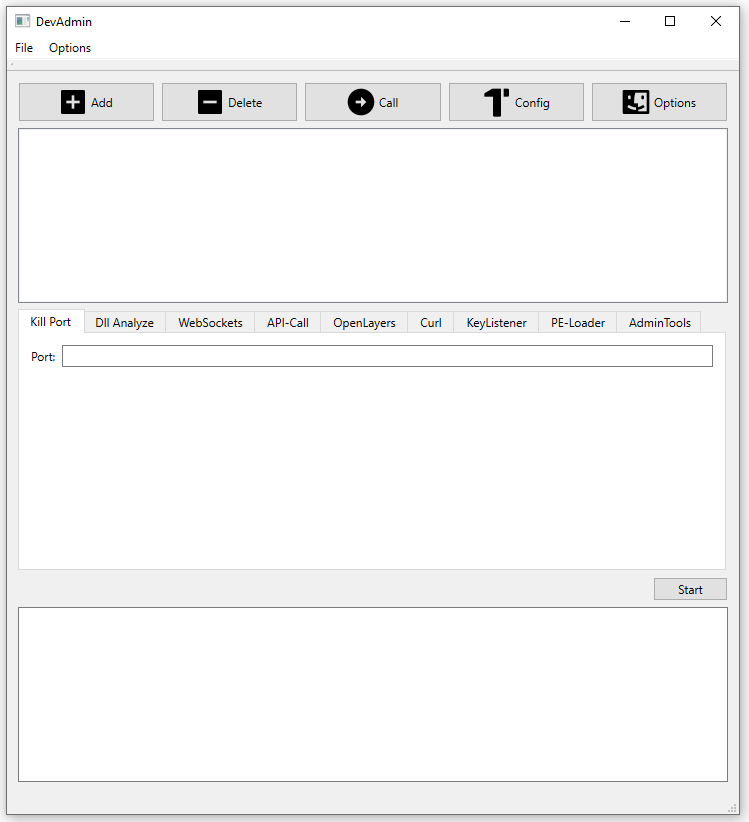

# QT Widget App: DevAdmin

## How to compile a C++ library with Visual Studio
Link to  [Tutorial Eigen Compile](https://eigen.tuxfamily.org/dox/GettingStarted.html)
1.  download EIGEN source: https://gitlab.com/libeigen/eigen/-/releases/3.4.0
2.  unzip to: "C:\Binaries\eigen-3.4.0" (no compiling needed!)
3.  In Visual Studio, make a new project: (`File | New | C++ Empty Project`)
4.  Paste sample code:
```sh
#include <iostream>
#include <Eigen/Dense>
using Eigen::MatrixXd;
int main()
{
    MatrixXd m(2, 2);
    m(0, 0) = 3;
    m(1, 0) = 2.5;
    m(0, 1) = -1;
    m(1, 1) = m(1, 0) + m(0, 1);
    std::cout << m << std::endl;
}
```
5.  Visual Studio > Project > Properties > C/C++ (`Additional Include Directories: "C:\Binaries\eigen-3.4.0\"`)

## How to include a library in C++
Link to  [JSON Library](https://github.com/open-source-parsers/jsoncpp)
1.  Paste sample code:
```sh
#include <fstream>
#include <iostream>
#include "json\json.h"
using namespace std;
using namespace Json;

 //1. If file exists, read from file
    std::string filePath = "setting.json";
    JsonWrapper s;
    cout << "is file: " << s.isFile(filePath);

```
2. run amalgamate.py, source and header files are created in "dist" directory
3. copy and include files in "dist" folder within your project
4. use the created JsonWrapper class!
5.  Visual Studio > Project > Properties > C/C++ (`Additional Include Directories: "C:\Binaries\eigen-3.4.0\"`)
6. (Visual Studio > Project > Properties > Linker > General(`Additional Library Directories: "C:\Binaries\json-develop`) --> not needed!!)
7.  Click Linker and add the Libraries Search Path

##Screenshots



#Links
https://stackoverflow.com/questions/58401595/reading-a-json-file-with-jsoncpp

amalgated include directly:
https://github.com/open-source-parsers/jsoncpp
https://stackoverflow.com/questions/26768639/jsoncpp-to-visual-studio

Form Layout:
https://www.youtube.com/watch?v=gWa2rqe8l6E&t=237s